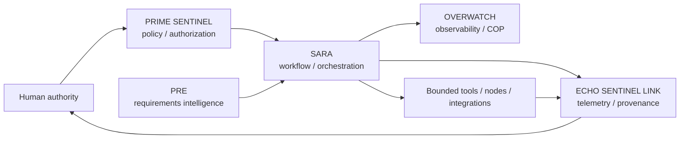

# Worldshepherd / SARA

**Governed workflow orchestration, evidence provenance, technical research integration, and mission-readiness engineering.**

> **AI proposes → human approves → automation stays bounded → actions and evidence are logged.**

This repository is the primary public engineering workspace for **Worldshepherd** and its SARA-centered architecture. It contains executable and CI artifacts, validation/supporting documentation, requirement-intelligence work, security/provenance work, partner-screening material, experimental nodes, and multidisciplinary research artifacts.

The repository intentionally distinguishes **implemented capability** from **research, simulation, hypothesis, and future integration work**.

## Start here

- [Run the canonical SARA runtime](runtime/README.md)
- [Worldshepherd capability map](docs/WORLDSHEPHERD_CAPABILITY_MAP.md)
- [Claims and evidence policy](docs/CLAIMS_AND_EVIDENCE_POLICY.md)
- [Active tasks](docs/operations/ACTIVE_TASKS.md)
- [Repository freshness policy](docs/operations/FRESHNESS_POLICY.md)
- [Repository/documentation index](docs/README.md)
- [Contributing](CONTRIBUTING.md)
- [Security policy](SECURITY.md)

## Core architecture



### Architectural roles

| Component | Intended role | Public-repo treatment |
|---|---|---|
| **SARA** | Governed workflows, orchestration, local relay-recording and administration | Canonical runnable package is `deployments/sara_verified_local_v1/`, exposed through `runtime/` and `scripts/sara.sh`; protected CI exercises its software/runtime boundary |
| **ECHO SENTINEL LINK** | Telemetry and evidence provenance | Provenance/anchor workflows and related artifacts are present |
| **PRIME SENTINEL** | Policy, authorization and bounded actions | Architecture/governance role plus asymmetric authorization integration; implementation claims must remain tied to specific code/tests |
| **OVERWATCH** | Observability/common operating picture | Architecture/integration lane; maturity varies by artifact |
| **PRE** | Predictive Requirements Engine / requirement-delta workflow | Requirement-delta, qualification and ingest tooling is present; prediction does not upgrade technical maturity |

## Canonical runnable SARA

The repository-level entry point is [`runtime/README.md`](runtime/README.md). The implementation remains in one configuration-controlled package at [`deployments/sara_verified_local_v1/`](deployments/sara_verified_local_v1/); it is **not duplicated** into a second source tree.

From a fresh clone with Python 3 available:

```bash
bash scripts/sara.sh setup
bash scripts/sara.sh run
```

Then open:

```text
http://127.0.0.1:9530/ui
```

Useful operator commands:

```bash
bash scripts/sara.sh check
bash scripts/sara.sh test
bash scripts/sara.sh smoke   # requires the local service to already be running
bash scripts/sara.sh path
```

Default service endpoints include `/health`, `/livez`, `/readyz`, `/ui`, authenticated `/v1/relay`, administrator `/v1/audit`, `/admin/registry`, and `/admin/selftest`.

**Boundary:** current `/v1/relay` success means governed **local recording/audit** (`recorded_local_only`). It does not establish external message delivery, arbitrary command execution, third-party activation, broadcasting, scanning, or autonomous network expansion.

The canonical runtime's protected workflow is [`.github/workflows/sara-verified-local-v1.yml`](.github/workflows/sara-verified-local-v1.yml). Historical SSPADAWANZZ requirements were reconciled against the hardened current implementation in [`WS_QE_2026_ADM_001.md`](deployments/sara_verified_local_v1/docs/WS_QE_2026_ADM_001.md).

## Current operating model

Worldshepherd uses exactly three top-level operating umbrellas:

- **#281 — Platform & Assurance** — runtime, security, governance, provenance, CI, reproducibility and repository freshness;
- **#282 — Science & Validation** — falsifiable scientific, simulation, hardware and physical-validation work;
- **#283 — Growth & Externalization** — opportunities, partners, outreach, capture, transition and commercialization.

See [`docs/operations/ACTIVE_TASKS.md`](docs/operations/ACTIVE_TASKS.md). Detailed issues and PRs remain child work rather than becoming competing top-level programs.

## Repository freshness and supersession

Worldshepherd preserves historical evidence without allowing it to masquerade as current guidance. The canonical lifecycle rules are in [`docs/operations/FRESHNESS_POLICY.md`](docs/operations/FRESHNESS_POLICY.md), and the latest dated audit is [`docs/operations/FRESHNESS_AUDIT_2026-09-15.md`](docs/operations/FRESHNESS_AUDIT_2026-09-15.md).

Important distinctions:

- old does not automatically mean stale;
- dated evidence remains evidence for its recorded configuration;
- useful work on an obsolete base becomes `RECONCILE_REQUIRED` rather than disposable;
- superseded artifacts should name their successor;
- branch names such as `temp`, `duplicate`, or `old` are not proof that deletion is safe;
- time-sensitive opportunity/contact facts must be re-verified before external use.

The scheduled/on-change Repository Freshness Gate enforces stable source-of-truth invariants and catches known regression patterns.

## What the repository currently contains

The public tree includes:

- `runtime/` — stable repository-level locator and operator guidance for the canonical SARA runtime;
- `scripts/sara.sh` — repository-root setup/run/test/smoke/check wrapper for canonical SARA;
- `deployments/sara_verified_local_v1/` — installable SARA package, API/UI, tests, fixtures, constraints, Docker/Compose artifacts, operational scripts, PRE/evidence tooling and runtime documentation;
- `.github/workflows/` — test/build, CodeQL, SARA Verified Local, release-attestation, resilience/rollback, freshness, NIST 800-171 precursor, provenance/anchor and other evidence-oriented CI workflows;
- `docs/` — architecture, PRE, claims-boundary, standards/conformance, operations/freshness, partner-screening, physics/research, provenance and integration documentation;
- `security/` — security-related artifacts;
- `tests/` — repository-level test material outside the canonical runtime package;
- `tools/` — engineering/analysis utilities including OSS semantic-health and repository-freshness checks;
- `config/` and other `deployments/` content — configuration/deployment material;
- `brd953_xyz_node/`, `flamehold_ai_node/`, `cisnet/`, and `external_anchor_pilots/` — experimental/integration nodes and related work.

## Evidence and maturity policy

Every substantive technical claim should be classifiable with one or more of these states:

- `PROVEN INTERNALLY`
- `IMPLEMENTED IN SOFTWARE`
- `SUPPORTED BY LITERATURE`
- `SIMULATED ONLY`
- `HYPOTHESIS`
- `SPECULATIVE EXTENSION`
- `REQUIRES LAB VALIDATION`
- `REQUIRES PARTNER VALIDATION`
- `REQUIRES LEGAL REVIEW`
- `NOT CURRENTLY CLAIMED`

**A document, equation, simulation, architecture diagram, or AI-generated design is not by itself evidence of a validated physical capability.** See [CLAIMS_AND_EVIDENCE_POLICY.md](docs/CLAIMS_AND_EVIDENCE_POLICY.md).

## Engineering and research lanes

Worldshepherd work represented directly or by active program architecture includes:

1. **Governed AI and automation** — authorization, workflow custody, human approval, auditability, configuration control.
2. **Mission assurance / C2 integration** — bounded automation, degraded-state operation, evidence capture, open interfaces.
3. **Cybersecurity and provenance** — CodeQL, release evidence, rollback/recovery, SBOM/provenance direction, access-control and NIST/CMMC preparation work.
4. **Opportunity and requirements intelligence** — PRE, Requirement Delta Records, partner screening and transition planning.
5. **Autonomous systems and robotics** — logistics, drones, humanoids/companions, human-machine teaming and safety-governed autonomy research.
6. **Resilient communications and PNT** — assured PNT integration, DDIL/degraded-state concepts, distributed sensing and edge-AI readiness.
7. **Digital twins / CBM+** — telemetry-driven condition monitoring, evidence-backed maintenance and model integration.
8. **RF and adaptive metasurfaces** — beamforming, null steering, tunable materials and programmable electromagnetic-boundary research.
9. **Advanced materials / additive manufacturing** — DED zoning, programmable/meta-alloy concepts and validation-roadmap work.
10. **Aerospace, space, propulsion and energy** — system concepts and multidisciplinary research; physical-performance claims require independent validation.

The [capability map](docs/WORLDSHEPHERD_CAPABILITY_MAP.md) gives the maturity boundary for each lane.

## Verification culture

A professional Worldshepherd artifact should answer five questions:

1. **What exactly is being claimed?**
2. **What evidence supports it?**
3. **Can someone reproduce the evidence?**
4. **What is still missing?**
5. **What test would falsify the claim?**

CI provides several evidence-oriented checks, but not every research artifact is executable. Treat each file according to its declared maturity and supporting evidence.

## Development

This repository contains multiple subprojects. SARA is the exception to the previous ambiguity: its **canonical runnable local package is explicitly declared** at `deployments/sara_verified_local_v1/` and exposed through `runtime/README.md` plus `scripts/sara.sh`.

For other components:

1. identify the component in [docs/README.md](docs/README.md);
2. read that component's own documentation/configuration;
3. inspect the relevant GitHub Actions workflow for its verification path;
4. do not assume one subproject's commands apply repository-wide.

For SARA runtime changes, the dedicated Verified Local gate installs constrained dependencies, compiles the package, runs the test suite, generates evidence artifacts, exercises deployment/recovery paths, and verifies the bounded local deployment profile.

## Public-repository boundary

This is a **public** repository. Do not commit credentials, export-controlled material, CUI, proprietary partner data, private contact data, or information that has not been cleared for public release.

No open-source license should be inferred solely from public visibility. Repository-specific licensing, contracts, and third-party rights govern reuse.

## Near-term repository priorities

- preserve the canonical SARA entry point and keep root commands synchronized with protected runtime CI;
- reconcile useful stale-base branches rather than merging old trees wholesale;
- migrate deprecated CI action/runtime dependencies through reviewable, fully gated changes;
- attach evidence manifests to major capability claims;
- consolidate overlapping research notes into canonical documents plus archives;
- publish architecture decision records (ADRs) for major interfaces;
- add local READMEs and explicit maturity/freshness gates to remaining active subprojects;
- evaluate a future dedicated `worldshepherd-sara` repository only when history, evidence links, release identity and migration continuity can be preserved;
- keep research lanes broad while making validation gates narrow, explicit, and measurable.

---

**Worldshepherd is strongest when breadth is paired with disciplined evidence.** This repository is being organized around that standard.
