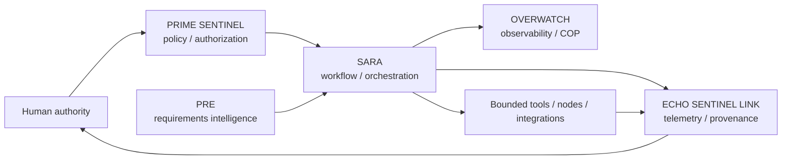

# Worldshepherd / SARA

**Governed workflow orchestration, evidence provenance, technical research integration, and mission-readiness engineering.**

> **AI proposes → human approves → automation stays bounded → actions and evidence are logged.**

This repository is the primary public engineering workspace for **Worldshepherd** and its SARA-centered architecture. It contains executable and CI artifacts, validation/supporting documentation, requirement-intelligence work, security/provenance work, partner-screening material, experimental nodes, and multidisciplinary research artifacts.

The repository intentionally distinguishes **implemented capability** from **research, simulation, hypothesis, and future integration work**.

## Start here

- [Worldshepherd capability map](docs/WORLDSHEPHERD_CAPABILITY_MAP.md)
- [Claims and evidence policy](docs/CLAIMS_AND_EVIDENCE_POLICY.md)
- [Repository/documentation index](docs/README.md)
- [Contributing](CONTRIBUTING.md)
- [Security policy](SECURITY.md)

## Core architecture

### Architectural roles

| Component | Intended role | Public-repo treatment |
|---|---|---|
| **SARA** | Governed workflows, orchestration, relay/integration patterns | Software, CI, configuration, validation and integration artifacts are present; runtime packaging is being consolidated |
| **ECHO SENTINEL LINK** | Telemetry and evidence provenance | Provenance/anchor workflows and related artifacts are present |
| **PRIME SENTINEL** | Policy, authorization and bounded actions | Architecture/governance role; implementation claims must be tied to specific code/tests |
| **OVERWATCH** | Observability/common operating picture | Architecture/integration lane; maturity varies by artifact |
| **PRE** | Predictive Requirements Engine / requirement-delta workflow | Requirement-delta and ingest documentation is present; prediction does not upgrade technical maturity |

## What the repository currently contains

The public tree includes:

- `.github/workflows/` — test/build, CodeQL, release-attestation, resilience/rollback, NIST 800-171 precursor, provenance/anchor and other evidence-oriented CI workflows;
- `docs/` — architecture, PRE, claims-boundary, standards/conformance, partner-screening, physics/research, provenance and integration documentation;
- `security/` — security-related artifacts;
- `tests/` — test material;
- `tools/` — engineering/analysis utilities including OSS semantic-health work;
- `config/` and `deployments/` — configuration/deployment material;
- `brd953_xyz_node/`, `flamehold_ai_node/`, `cisnet/`, and `external_anchor_pilots/` — experimental/integration nodes and related work.

## Evidence and maturity policy

Every substantive technical claim should be classifiable with one or more of these states:

- `PROVEN INTERNALLY`
- `IMPLEMENTED IN SOFTWARE`
- `SUPPORTED BY LITERATURE`
- `SIMULATED ONLY`
- `HYPOTHESIS`
- `SPECULATIVE EXTENSION`
- `REQUIRES LAB VALIDATION`
- `REQUIRES PARTNER VALIDATION`
- `REQUIRES LEGAL REVIEW`
- `NOT CURRENTLY CLAIMED`

**A document, equation, simulation, architecture diagram, or AI-generated design is not by itself evidence of a validated physical capability.** See [CLAIMS_AND_EVIDENCE_POLICY.md](docs/CLAIMS_AND_EVIDENCE_POLICY.md).

## Engineering and research lanes

Worldshepherd work represented directly or by active program architecture includes:

1. **Governed AI and automation** — authorization, workflow custody, human approval, auditability, configuration control.
2. **Mission assurance / C2 integration** — bounded automation, degraded-state operation, evidence capture, open interfaces.
3. **Cybersecurity and provenance** — CodeQL, release evidence, rollback/recovery, SBOM/provenance direction, access-control and NIST/CMMC preparation work.
4. **Opportunity and requirements intelligence** — PRE, Requirement Delta Records, partner screening and transition planning.
5. **Autonomous systems and robotics** — logistics, drones, humanoids/companions, human-machine teaming and safety-governed autonomy research.
6. **Resilient communications and PNT** — assured PNT integration, DDIL/degraded-state concepts, distributed sensing and edge-AI readiness.
7. **Digital twins / CBM+** — telemetry-driven condition monitoring, evidence-backed maintenance and model integration.
8. **RF and adaptive metasurfaces** — beamforming, null steering, tunable materials and programmable electromagnetic-boundary research.
9. **Advanced materials / additive manufacturing** — DED zoning, programmable/meta-alloy concepts and validation-roadmap work.
10. **Aerospace, space, propulsion and energy** — system concepts and multidisciplinary research; physical-performance claims require independent validation.

The [capability map](docs/WORLDSHEPHERD_CAPABILITY_MAP.md) gives the maturity boundary for each lane.

## Verification culture

A professional Worldshepherd artifact should answer five questions:

1. **What exactly is being claimed?**
2. **What evidence supports it?**
3. **Can someone reproduce the evidence?**
4. **What is still missing?**
5. **What test would falsify the claim?**

CI already provides several evidence-oriented checks, but not every research artifact is executable. Treat each file according to its declared maturity and supporting evidence.

## Development

The repository contains multiple subprojects rather than one fully normalized package. Before running a component:

1. identify the component in [docs/README.md](docs/README.md);
2. read that component's own documentation/configuration;
3. inspect the relevant GitHub Actions workflow for its verification path;
4. do not assume one subproject's commands apply repository-wide.

For the currently enforced OSS semantic-health CI path, GitHub Actions uses Python 3.12, compiles `tools/oss_health`, runs its unit tests, validates stored patch artifacts, rejects unresolved merge-conflict markers, and performs whitespace checks.

## Public-repository boundary

This is a **public** repository. Do not commit credentials, export-controlled material, CUI, proprietary partner data, private contact data, or information that has not been cleared for public release.

No open-source license should be inferred solely from public visibility. Repository-specific licensing, contracts, and third-party rights govern reuse.

## Near-term repository priorities

- normalize SARA's runnable package and operator/admin interface into a single reproducible entry point;
- attach evidence manifests to major capability claims;
- consolidate overlapping research notes into canonical documents plus archives;
- add issue/PR templates tied to claim state and validation evidence;
- publish architecture decision records (ADRs) for major interfaces;
- keep research lanes broad while making validation gates narrow, explicit, and measurable.

---

**Worldshepherd is strongest when breadth is paired with disciplined evidence.** This repository is being organized around that standard.