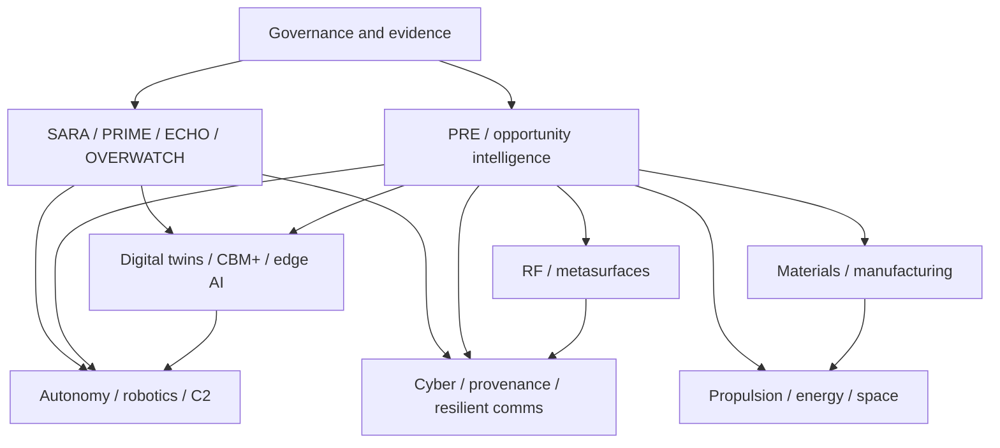

# Worldshepherd Capability Map

## Purpose

This map makes Worldshepherd's breadth legible without implying that every research lane is equally mature.

**Rule:** the most ambitious interpretation of a document is never the default. Use the claim state actually supported by code, test evidence, literature, simulation, lab data, or partner validation.

## Capability portfolio

| Lane | What Worldshepherd covers | Current public evidence posture | Required next evidence |
|---|---|---|---|
| **SARA governance/orchestration** | governed workflows, relay/integration patterns, audit/evidence handling, bounded automation | `IMPLEMENTED IN SOFTWARE` for repository components that have code/tests; runtime packaging remains fragmented | one canonical install/start/test path plus versioned integration evidence |
| **ECHO SENTINEL LINK** | telemetry/evidence provenance, anchoring, configuration lineage | workflow and provenance artifacts are present; scope varies by artifact | end-to-end provenance demo with documented trust boundaries and failure cases |
| **PRIME SENTINEL** | policy, authorization, human approval, fail-closed control | architecture/governance role; claim only controls tied to specific code/tests | explicit policy engine interface tests and authorization-boundary evidence |
| **OVERWATCH** | observability, status aggregation, common operating picture | architecture/integration lane | runnable dashboard/telemetry integration with degraded-state tests |
| **PRE** | requirement deltas, demand classes, readiness gaps, partner needs, evidence targets | `IMPLEMENTED AS GOVERNANCE/SCHEMA`; ingest/export artifacts exist | repeatable source-to-RDR pipeline with precision/recall and analyst-review metrics |
| **Mission assurance / C2** | evidence-backed workflows, MOSA/open adapters, degraded-state operation, replay, decision provenance | software/research artifacts; deployment readiness varies | representative integration demo against an external interface or partner testbed |
| **Cybersecurity / provenance** | CodeQL, release evidence, rollback/recovery, NIST 800-171 precursor, configuration custody, SBOM/provenance direction | CI/security artifacts present; **no certification implied** | threat model, control mapping, reproducible security test suite, external assessment where needed |
| **Autonomous logistics** | governed autonomy, sustainment workflows, DDIL operation, human-machine teaming | design/integration lane | hardware-in-the-loop or field-representative demo with safety and comms-loss behavior |
| **Drones / VTOL systems** | mission-specific unmanned aircraft concepts, propulsion integration, sensing/autonomy | design/research lane | weight/power/aero closure, subsystem bench tests, flight test evidence |
| **Humanoids / companion robotics** | locomotion, manipulation, sensing, resource scouting, maintenance/fabrication support concepts | design/research lane | subsystem prototypes, safety case, manipulation/locomotion benchmarks, integrated prototype |
| **Resilient communications / APNT** | assured PNT integration, DDIL, distributed sensing, resilient links | requirement/integration research; no physical APNT performance claim by default | partner hardware integration, interference/degraded-state test data, measured PNT performance |
| **Edge AI / distributed sensing** | edge inference, sensor fusion, interpretable/traceable decisions | software/research lane | benchmark suite with latency, accuracy, power, failure-mode and provenance metrics |
| **Digital twins / CBM+** | model-backed condition monitoring, maintenance evidence, replay, configuration lineage | software/research lane | calibrated model against representative asset data and decision-quality metrics |
| **RF / adaptive metasurfaces** | beamforming, null steering, tunable RF/material states, programmable EM-boundary concepts | typically `SUPPORTED BY LITERATURE`, `SIMULATED ONLY`, `HYPOTHESIS`, or `REQUIRES LAB VALIDATION` depending artifact | EM simulation tied to geometry/material parameters, fabricated coupon/array, calibrated chamber measurements |
| **Advanced materials / meta-alloys** | Al-Ti-family programmable/deposition-zoned alloy concepts, DED process design, property targeting | IP/research stage; physical claims require coupon evidence | composition/process model, coupon fabrication, microscopy, mechanical/thermal/corrosion test matrix |
| **Additive manufacturing / DED** | process zoning, manufacturing lineage, qualification evidence | research/process-integration lane | machine/process-specific parameter windows, repeatability data, material qualification |
| **Propulsion** | electric, plasma/field, aerospace and alternative propulsion research; practical propulsion architecture work | maturity is concept-specific; no unexplained/reactionless performance is assumed | conservation-consistent model, power/thermal closure, calibrated thrust/efficiency measurement, independent replication where warranted |
| **Energy systems** | storage, power distribution, conversion, renewable/mission-energy integration | research/system-design lane | chemistry/topology-specific safety, cycle-life, thermal, power and environmental data |
| **Space systems** | autonomous operations, particulate awareness, in-space robotics/resource assessment, resilient comms | systems-research lane | environment-specific modeling, hardware qualification and mission-relevant test campaign |
| **Quantum / advanced physics** | mathematical models, quantum-material and quantum-information adjacent research | usually `SUPPORTED BY LITERATURE`, `SIMULATED ONLY`, `HYPOTHESIS`, or `SPECULATIVE EXTENSION` unless a specific implementation proves otherwise | benchmark against accepted theory/experiment and clearly identify any genuinely novel, falsifiable claim |
| **Opportunity intelligence / capture** | government opportunity scanning, partner fit, qualification gaps, transition pathways | analytical workflow; opportunity facts require source verification | maintain official-source provenance, dated status, scoring assumptions and update cadence |

## Portfolio architecture

## What should become separate repositories

As components become independently reproducible, split them from the monorepo-style research workspace. Strong candidates are:

1. **worldshepherd-sara** — canonical governed orchestration/runtime package;
2. **worldshepherd-pre** — Requirement Delta Records, ingestion, scoring and evidence schemas;
3. **worldshepherd-provenance** — ECHO/attestation/evidence chain tooling;
4. **worldshepherd-labs** — clearly labeled simulation/research notebooks and models;
5. **worldshepherd-hardware** — only hardware designs with configuration-controlled BOM/test evidence;
6. **worldshepherd-docs** — public architecture, governance, roadmaps and integration guides.

Until repository creation and migration are deliberate, this repository should act as the indexed source-of-truth with strong maturity labels.

## Promotion gates

A lane should not be promoted in public language merely because more material exists. Promotion requires better evidence.

### Research → simulated

- governing equations/assumptions documented;
- model is executable;
- numerical checks and sensitivity analysis exist.

### Simulated → lab validated

- physical test article exists;
- instrumentation/calibration documented;
- predeclared metrics and uncertainty reported;
- results are reproducible.

### Lab validated → partner validated

- external configuration and acceptance criteria are explicit;
- partner or independent evaluator observes/repeats relevant tests;
- deviations and negative evidence are retained.

### Software implemented → operationally credible

- install/run path is reproducible;
- CI passes on supported environments;
- authorization and failure modes are tested;
- logs/provenance are inspectable;
- recovery/rollback is demonstrated;
- external integration is tested where the claim depends on it.

## Public-facing rule

Worldshepherd can legitimately be broad. The professional standard is to make **maturity narrow and explicit**. That lets the portfolio grow without turning research breadth into accidental overclaiming.
