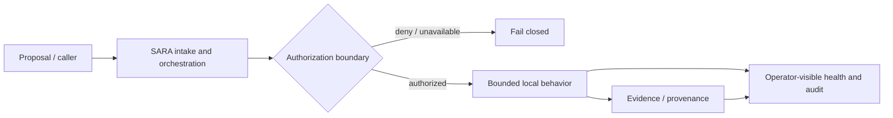

# Architecture and threat model

## Review scope

This document describes the **local SARA reference implementation**, not every research artifact in the Worldshepherd repository.

## Design objective

The design goal is not autonomous reach. It is the opposite: reduce the number of ways automation can act without an inspectable authorization and evidence trail.

The current `/v1/relay` behavior terminates at a **local durable record**. It does not perform arbitrary operating-system command execution or external third-party activation.

## Trust boundaries

### Boundary A — relay versus administrator

Two independent bearer credentials exist. Relay authority is sufficient to submit a bounded relay record. Administrative authority is required for audit, registry, evidence, and self-test operations.

Security property under review: possession of the relay token must not create an administrative write/read path.

### Boundary B — generic registry versus protected namespaces

The generic registry patch route rejects writes to protected PRIME/EVENT namespaces. Governed state is expected to move through purpose-specific APIs rather than a catch-all patch operation.

Security property under review: no alternate generic path should permit the same protected mutation.

### Boundary C — SARA verifier versus PRIME signer

The optional PRIME SENTINEL signer is treated as a separate service boundary. SARA should receive public verification material, not the signer private key. Authorization assertions are expected to be identity-bound, environment-bound, time-bounded, replay-resistant, and one-time consumable where the relevant flow requires it.

A signing `key_id` identifies particular public-key material. The signer durably binds key IDs to fingerprints in its issuance ledger; SARA records the verifying key fingerprint with each accepted authorization and rechecks that exact fingerprint before later use. Replacing key material behind an existing ID therefore fails closed.

Security properties under review: compromise of SARA alone should not automatically grant authority to mint valid PRIME assertions, and key rotation must not silently preserve authority verified under different key material.

### Boundary D — application evidence versus external assurance

Local audit and ECHO-style content-addressed evidence are operational evidence, not immutable legal records and not an external attestation system.

Security property under review: the UI, documentation, schemas, and generated artifacts must not imply stronger assurance than the implementation provides.

### Boundary E — local transaction boundary versus distributed storage

The local `DurableStore` uses an in-process re-entrant lock plus atomic file replacement. This is a real transaction boundary for the supported single SARA writer process, but it is not a distributed lock and it does not coordinate independent processes sharing one data directory.

Security property under review: deployment must preserve **one SARA writer process per writable SARA data volume**. Multi-process or clustered writers require a different persistence/locking design and requalification.

## Assets

The review should treat the following as security-relevant assets:

- administrator credential;
- relay credential;
- PRIME signer private key and service credential;
- public-key identity, fingerprint, and revocation configuration;
- protected registry state;
- replay/consumption state for authorization assertions;
- audit and evidence records;
- local persistent storage;
- release identity and build provenance metadata.

## Threat actors

The reference threat model includes:

- an unauthenticated local process;
- a process holding only the relay credential;
- a mistaken or malicious administrator;
- a compromised SARA service process;
- a caller presenting stale, malformed, replayed, or context-mismatched authorization material;
- an operator who incorrectly reuses a key ID for different key material;
- a misconfigured deployment that attempts multiple writers against one SARA data directory;
- a host-level actor able to modify writable local storage;
- a maintainer or CI process that unintentionally overstates an internal test result as external certification.

The reference implementation **does not claim to withstand a fully compromised host** while preserving immutable local evidence. A host-level attacker with sufficient privilege can alter writable application state. Stronger assurance requires externalized or hardware-backed controls outside the current boundary.

## Failure semantics to inspect

A skeptical review should verify that:

1. missing required runtime credentials prevent normal startup;
2. identical relay/admin credentials are rejected;
3. malformed or oversized requests are rejected before becoming useful work;
4. unavailable durable state produces a non-ready service rather than a false healthy signal;
5. protected namespace mutation is rejected through the generic patch route;
6. missing/invalid authorization assertions fail closed on governed operations;
7. replayed authorization material is rejected where one-time semantics apply;
8. replacement public-key material under a previously recorded key ID invalidates the old recorded authorization;
9. audit/evidence failure is visible rather than silently converted into success;
10. no endpoint unexpectedly shells out or turns user-controlled input into arbitrary command execution;
11. the deployment does not scale multiple SARA writers against one local data volume;
12. documentation never upgrades internal evidence into certification.

## Deliberate non-goals

This review target does not claim:

- Internet-facing production hardening;
- zero-trust network deployment by itself;
- multi-writer/distributed local JSON storage;
- immutable/WORM audit storage;
- HSM/KMS-backed production signing custody;
- organization-wide CMMC or NIST SP 800-171 conformity;
- RMF/ATO or FedRAMP authorization;
- FIPS module validation;
- government interoperability approval;
- partner or customer validation;
- field validation of broader physical-system research;
- autonomous external discovery, scanning, or self-expanding behavior.

## Design bias

When forced to choose between a larger capability surface and a smaller inspectable one, this reference implementation is intended to choose the smaller surface.

If the implementation contradicts that principle, the implementation should lose.
